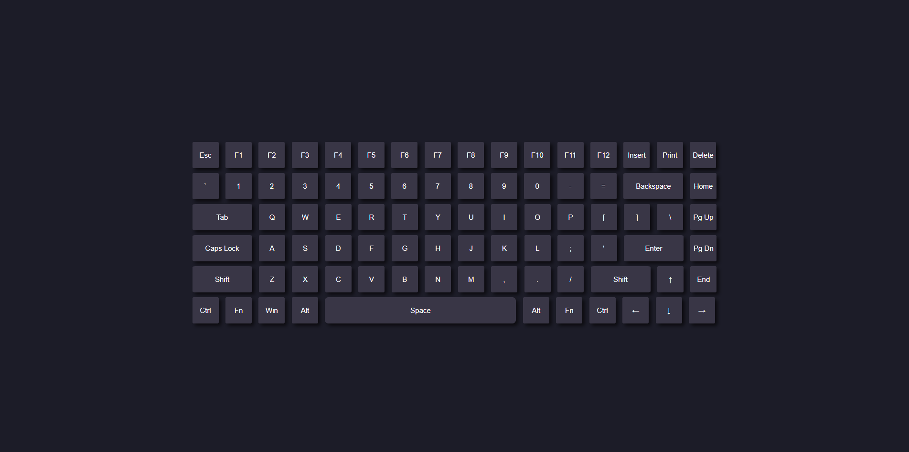

# WiFiKeyboard

WiFiKeyboard is an ESP32 Arduino project that provides a web user interface (UI) with WebSocket support, allowing it to function as a wireless keyboard. It allows you to control a target device remotely by emulating key presses over a wireless connection.

## Features

- Web-based UI: Access the keyboard interface through a web browser on any device connected to the same network as the ESP32.
- WebSocket Support: Utilize WebSocket communication for real-time interaction with the target device.
- Wireless Keyboard Emulation: Send key press events wirelessly to control the target device as if using a physical keyboard.
- Easy to Use: Simple and intuitive user interface for a seamless user experience.

## Screenshots

Here are some screenshots of the WiFiKeyboard web user interface:

Web UI

## Getting Started

To get started with the WiFiKeyboard project, follow these steps:

1. **Hardware Setup**: Connect your ESP32 board to the required peripherals (e.g., keyboard matrix or individual key switches) according to the project specifications.

2. **Software Setup**:

   - Install [PlatformIO](https://platformio.org/installation) on your computer, which provides an open-source ecosystem for IoT development.

   - Clone or download this repository to your local machine.

3. **Configuration**: Open the project in your preferred PlatformIO-compatible IDE (e.g., Visual Studio Code with PlatformIO extension)

4. **Upload and Build**:

   - Connect your ESP32 board to your computer via USB.

   - In your PlatformIO IDE, open the project and click on the "Build" button to compile the code.

   - Once the build is successful, click on the "Upload" button to flash the firmware onto your ESP32 board.

5. **Access the Web UI**: Connect your computer or mobile device to the same network as the ESP32, and open a web browser. Enter the IP address of the ESP32 to access the web user interface.

6. **Wireless Keyboard**: Use the web interface to send keyboard inputs to the target device wirelessly. Enjoy the convenience of a wireless keyboard experience!

## Contributing

Contributions are welcome! If you have any ideas, suggestions, or bug reports, please open an issue or submit a pull request. Let's make WiFiKeyboard even better together!

## License

This project is licensed under the [MIT License](LICENSE), allowing you to freely use and modify the code for personal or commercial purposes.

## Acknowledgements

WiFiKeyboard is built upon the work and contributions of various open-source projects and libraries.

- [ESP32 Arduino Core](https://github.com/espressif/arduino-esp32)
- [WebSocket library for Arduino](https://github.com/Links2004/arduinoWebSockets)
- [ArduinoJson](https://github.com/bblanchon/ArduinoJson)
- [WiFiManager](https://github.com/tzapu/WiFiManager)
- [WebSockets](https://github.com/Links2004/arduinoWebSockets)